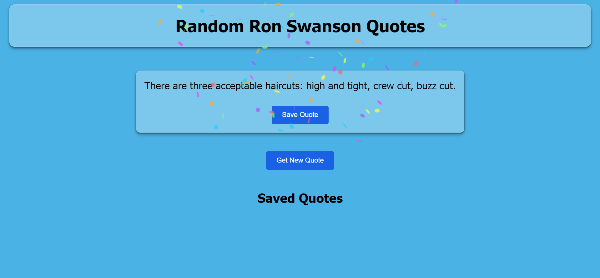

# Quote Generator App

This is a simple Quote Generator App that fetches random quotes and allows users to save their favorite quotes. The app also features a confetti animation when a quote is saved or a new quote is generated.

## Features

- Fetch random quotes from an API
- Save favorite quotes
- Confetti animation on saving or generating a quote

## Screenshot



## Installation

1. Clone the repository:

   ```sh
   git clone https://github.com/prem-prasad1710/Quote-Generator---TheGoodGame-Theory.git
   ```
   
2. Navigate to the project directory:

3. Install the dependencies:

## Usage
Start the development server:
 ```sh
npm start
```

Open your browser and navigate to http://localhost:3000.

## Technologies Used :
React<br>
Axios<br>
canvas-confetti<br>

## Contributing
Contributions are welcome! Please open an issue or submit a pull request for any improvements or bug fixes.

## License
This project is licensed under the MIT License.
